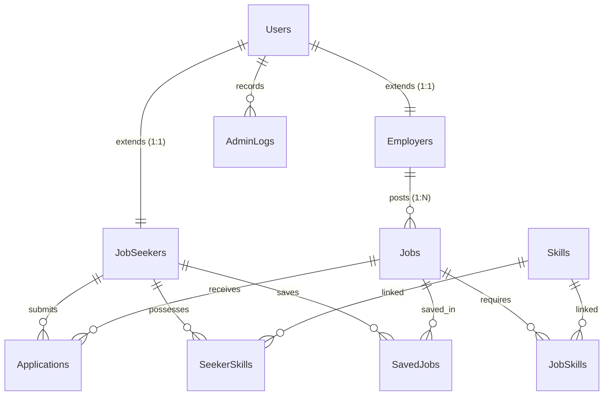

# 🚀 HireStream - Full-Stack Job Portal

A modern, high-performance, and feature-rich full-stack Job Portal built using a robust SQL-based relational schema on the backend and a highly polished React UI on the frontend. The application features three specialized portals tailored to **Job Seekers**, **Employers**, and **Platform Administrators**, integrated with file uploads, search-and-match scoring systems, and complete moderation workflows.

---

## 🛠️ Architecture & Tech Stack

This project is organized as a monorepo consisting of two primary services:
1. **[Backend Server](./backend)**: A RESTful Express API built on Node.js using ES Modules, communicating with a MariaDB relational database. It integrates with Cloudinary for media/resume storage and uses JSON Web Tokens (JWT) for secure role-based session management.
2. **[Frontend Client](./frontend)**: A single-page application (SPA) built using Vite, React 19, TypeScript, TailwindCSS v4, Framer Motion, and Lucide React. It provides dynamic layouts, interactive dashboards, custom toast notifications, and client-side form validations.

```
┌────────────────────────────────────────────────────────┐
│                    React Frontend (SPA)                │
│             Vite • Tailwind CSS v4 • TypeScript        │
└───────────┬────────────────────────────────────────┬───┘
            │                                        │
     Uploads│(Multer)                     JWT / APIs │(Axios)
            ▼                                        ▼
┌───────────┴────────────────────────────────────────┴───┐
│                    Express Backend API                 │
│              Node.js • JWT Auth • Cloudinary           │
└───────────────────────────┬────────────────────────────┘
                            │
                   SQL      │ (MariaDB Pool)
                            ▼
┌────────────────────────────────────────────────────────┐
│                   MariaDB Database                     │
│               Relational Schema (10 tables)            │
└────────────────────────────────────────────────────────┘
```

### 💻 Stack Details
- **Frontend Core**: React 19, TypeScript, Vite 6, React Router DOM v7
- **Styling & Animations**: TailwindCSS v4, Framer Motion (`motion`)
- **Backend API**: Express v5, Node.js (ESM), Multer
- **Database**: MariaDB v3, connection pooling via `mariadb` driver
- **Authentication**: JWT (`jsonwebtoken`), Password hashing (`bcryptjs`)
- **File & Media Storage**: Cloudinary (integrated via `multer-storage-cloudinary`)

---

## ✨ Features by Role

### 👤 Job Seeker (Candidate)
- **Interactive Dashboard**: Aggregated stats showing applied, shortlisted, rejected, and hired counts.
- **Smart Job Search**: Explore verified jobs, filter by location, job type (Full-Time, Part-Time, Internship), and match by required skills.
- **Skill Match Scoring**: View real-time matching metrics between your seeker profile skills and job post requirements.
- **Resume Management**: Upload PDF resumes securely to Cloudinary with download capability.
- **Saved Jobs**: Bookmark job opportunities to apply later.
- **Application Tracking**: Apply to jobs and withdraw/revoke applications in real time.

### 🏢 Employer
- **Job Post Lifecycle**: Create, update, view, and delete job listings. Toggle job status (`open` or `closed`).
- **Applicant Tracking System (ATS)**: Review candidate details, experience years, education, and specific skills with proficiency tags.
- **Resume Downloading**: Directly download or view candidate resume PDFs.
- **Status Progression**: Move applications through stages (`applied` ➜ `shortlisted` ➜ `hired` / `rejected`).
- **Employer Dashboard**: Graphical or card-based stats summarizing active postings, total applications, and status counts.

### 🛡️ Platform Administrator
- **Job Verification**: Moderate and approve pending employer job posts via a verification toggle.
- **User Management**: Lock, unlock, activate, or deactivate job seekers and employers.
- **Audit Logs**: Maintain platform integrity with a persistent log database (`AdminLogs`) capturing administrative actions.
- **Platform Analytics Dashboard**: Consolidated global system statistics.

---

## 🗄️ Database Schema & Tables

The database is built on top of a highly optimized MariaDB relational schema containing **10 interrelated tables**. Refer to the [db_schema.txt](./plannings/db-relateds/db_schema.txt) file for table definition statements.



### Table Definitions:
1. **`Users`**: Base authentication table containing emails, bcrypt password hashes, activation states, and roles (`jobseeker`, `employer`, `admin`).
2. **`JobSeekers`**: Profile extension for seekers containing full name, phone number, education, years of experience, resume path, and profile photo.
3. **`Employers`**: Profile extension for employers containing company name, phone, industry, size, location, website, and company logo.
4. **`Jobs`**: Postings containing description, salary ranges, location, status, type, verification flags, and metrics.
5. **`Applications`**: Many-to-Many mapping between `Jobs` and `JobSeekers` tracking state progression (`applied`, `shortlisted`, `rejected`, `hired`).
6. **`Skills`**: Master lookup table representing skill keywords.
7. **`JobSkills`**: Junction table mapping `Jobs` to `Skills` requirements.
8. **`SeekerSkills`**: Junction table mapping `JobSeekers` to `Skills` with proficiency levels (`beginner`, `intermediate`, `advanced`).
9. **`SavedJobs`**: Bookmarked jobs for job seekers.
10. **`AdminLogs`**: Audit logging records indicating which admin performed what moderation activity.

---

## 🔌 API Routes Reference

For route implementation details, view the controllers in the backend folder. All endpoints are grouped by router prefixes:

### 🔐 1. Authentication (`/api/auth`)
*   `POST /register` — Register a new user and corresponding profile.
*   `POST /login` — Log in and receive a stateless JWT access token.
*   `GET /resume-download/:application_id` — Secure endpoint to download candidate resumes (requires authentication).

### 🛡️ 2. Platform Administration (`/api/admin`)
*   `GET /stats` — Fetch global platform analytics.
*   `GET /employers` — Retrieve all registered employers.
*   `GET /seekers` — Retrieve all registered job seekers.
*   `GET /users` — Paginate/list all users.
*   `GET /users/:user_id` — Fetch detailed user profile (seeker/employer).
*   `PATCH /users/:user_id/status` — Deactivate or reactivate accounts.
*   `DELETE /users/:user_id` — Hard delete a user account.
*   `GET /all-jobs` — List all jobs (verified and unverified).
*   `PATCH /verify-job/:job_id` — Verify/Approve a pending job posting.
*   `PATCH /unverify-job/:job_id` — Reject or unverify a job posting.
*   `DELETE /jobs/:job_id` — Admin job post removal.
*   `GET /logs` — Retrieve system administrative logs.

### 🏢 3. Employer Portal (`/api/employer`)
*   `GET /stats` — Fetch job statistics, active counts, and application breakdown.
*   `POST /post` — Post a new job (includes mapping required skills).
*   `GET /my-jobs` — Fetch jobs posted by the logged-in employer.
*   `PUT /update/:job_id` — Update job details and skill criteria.
*   `PATCH /status/:job_id` — Toggle job status between `open` and `closed`.
*   `DELETE /delete-jobs/:job_id` — Delete a job listing.
*   `GET /applicants/:job_id` — List and filter applicants for a job (by skill match, experience, etc.).
*   `PATCH /application-status/:application_id` — Move candidate to `shortlisted`, `hired`, or `rejected`.
*   `GET /profile` — Fetch corporate profile.
*   `PUT /profile` — Update corporate profile fields.
*   `POST /logo` — Upload company profile picture (integrates with Cloudinary).

### 👤 4. Candidate Portal (`/api/seeker`)
*   `GET /stats` — Retrieve seeker application statistics.
*   `GET /job-match/:job_id` — Fetch the matching score between the seeker's skills and the job requirement.
*   `POST /apply/:job_id` — Submit application to a job.
*   `GET /my-applications` — List submitted application history.
*   `DELETE /revoke/:application_id` — Revoke/withdraw a pending application.
*   `GET /profile` — Retrieve seeker profile.
*   `PUT /profile` — Update seeker profile.
*   `PUT /profile/resume` — Upload/update PDF resume.
*   `GET /profile/resume/download` — Download own resume file.
*   `PUT /skills` — Update list of skills with proficiency ratings.
*   `POST /saved-jobs/:job_id` — Save a job listing.
*   `GET /saved-jobs` — List all saved job listings.
*   `DELETE /saved-jobs/:job_id` — Remove a job from saved list.
*   `POST /photo` — Upload seeker profile photo.

### 🌍 5. Public / General (`/api/public`)
*   `GET /jobs` — Browse verified, open job postings (supports text search, filters, sorting).
*   `GET /jobs/:job_id` — View details of a specific job.
*   `GET /skills` — Fetch autocomplete skill list.
*   `GET /landing-jobs` — Retrieve featured job listings for the homepage landing layout.

---

## ⚙️ Installation & Local Setup

### Prerequisites
- [Node.js](https://nodejs.org/) (Version 18 or above recommended)
- [MariaDB](https://mariadb.org/) or MySQL server instance running locally or remotely
- A [Cloudinary](https://cloudinary.com/) account for managing media/resume file uploads

### 🗄️ Database Configuration
1. Start your MariaDB/MySQL instance.
2. Log into the database console and run the statements inside [db_schema.txt](./plannings/db-relateds/db_schema.txt) to create the schema and index structures:
   ```sql
   SOURCE plannings/db-relateds/db_schema.txt;
   ```

### 🔑 Server Setup (`/backend`)
1. Open a terminal and navigate to the backend folder:
   ```bash
   cd backend
   ```
2. Install packages:
   ```bash
   npm install
   ```
3. Create a **backend `.env` file** based on the variables template below:
   ```env
   PORT=5000
   DB_HOST="localhost"
   DB_USER="root"
   DB_PASS="YOUR_DB_PASSWORD"
   DB_NAME="job_portal"
   JWT_SECRET="YOUR_JWT_SIGNING_KEY"
   ADMIN_SECRET="YOUR_ADMIN_REGISTRATION_SECRET"
   CLOUDINARY_CLOUD_NAME="YOUR_CLOUDINARY_CLOUD_NAME"
   CLOUDINARY_API_KEY="YOUR_CLOUDINARY_API_KEY"
   CLOUDINARY_API_SECRET="YOUR_CLOUDINARY_API_SECRET"
   ```
4. Seed the database with mock users, employers, jobs, skills, applications, and saved-jobs:
   ```bash
   # Seeds a standard collection of profiles, matching skills, resumes, and logs
   npm run seed
   
   # Resets the tables (TRUNCATE) and seeds fresh data
   npm run seed:reset
   ```
5. Start the backend developer API server:
   ```bash
   node server.js
   ```

### 💻 Client Setup (`/frontend`)
1. Open a new terminal and navigate to the frontend folder:
   ```bash
   cd frontend
   ```
2. Install dependencies:
   ```bash
   npm install
   ```
3. Create a **frontend `.env`** file to specify the API server host:
   ```env
   VITE_API_BASE_URL="http://localhost:5000"
   ```
4. Start the Vite React development server:
   ```bash
   npm run dev
   ```

---

## 🧪 Postman Setup

For testing API endpoints, importing collections, or running integration flows:
*   A postman workspace backup file containing pre-configured requests is available at:
    **[Job Portal API.postman_collection.json](./postman/collections/Job%20Portal%20API.postman_collection.json)**
*   Import this collection into Postman and set the collection-level environment variable `base_url` to your active backend host (e.g., `http://localhost:5000`).
